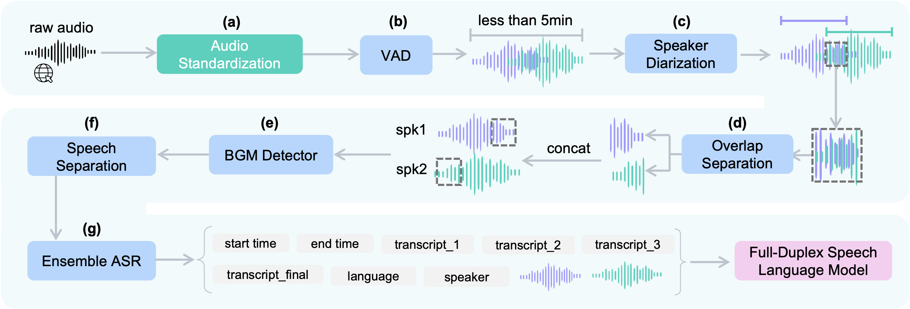

# Sommelier

A comprehensive audio processing pipeline for speaker diarization, automatic speech recognition, background music removal, and more.

[[Paper]](https://arxiv.org/pdf/2603.25750) [[Demo]](https://kyudan1.github.io/sommelier.github.io/)



## Features

- **Speaker Diarization**: Speaker separation using NeMo Sortformer
- **Automatic Speech Recognition (ASR)**: Speech recognition based on Whisper
- **ASR MoE (Mixture of Experts)**: Ensemble of Whisper, Parakeet, and Canary models using ROVER voting
- **Background Music Removal**: Music detection with PANNs and vocal extraction with Demucs
- **Word-level Timestamps**: Precise word-level time alignment using WhisperX

## Environment Setup

### 1. Create a Conda Environment

```bash
conda create -n sommelier python=3.10 -y
conda activate sommelier
```

### 2. Install ffmpeg

ffmpeg is required for audio format conversion (MP3, FLAC, etc.).

```bash
conda install -c conda-forge ffmpeg -y
```

### 3. Install Python Dependencies

PyTorch must be installed **before** `nemo-toolkit[all]` because some dependencies require `torch` at build time.

```bash
cd podcast-pipeline

# Step 1: Install PyTorch first
pip install torch==2.7.1 torchaudio==2.7.1

# Step 2: Install all dependencies
pip install -r requirements.txt

# Step 3: nemo-toolkit[all] may override the torch version.
# Reinstall the correct versions after requirements.txt:
pip install torch==2.7.1 torchaudio==2.7.1 torchvision==0.22.1
```

> **Note**: Some packages (e.g., `pyannote.audio`, NeMo toolkit) may require a Hugging Face token.
> 1. CLI login:
> ```bash
> huggingface-cli login
> ```
> 2. Also set the token in `config.json`:
> ```json
> {
>   "huggingface_token": "hf_YOUR_TOKEN_HERE"
> }
> ```

### 4. Verify Installation

```bash
python -c "import torch; print(f'PyTorch: {torch.__version__}, CUDA: {torch.cuda.is_available()}')"
python -c "import whisperx; print('WhisperX OK')"
python -c "import demucs; print('Demucs OK')"
python -c "import nemo; print('NeMo OK')"
python -c "import pyannote.audio; print('Pyannote OK')"
python main_original_ASR_MoE.py --help
```

## Usage

### Basic Execution

```bash
bash run_test_all.sh
```

The main execution script is [run_test_all.sh](podcast-pipeline/run_test_all.sh), which allows you to run Sommelier with various configuration combinations.

Before running, open `run_test_all.sh` and set the `folders` variable to the path of the folder containing your audio files:

```bash
folders=(
  "/path/to/your/audio/folder"
)
```

### Multi-GPU Execution

For large-scale batch processing across multiple GPUs, use `run_frontend.py`:

```bash
python run_frontend.py
```

Before running, edit the configuration section at the top of the script:

```python
BACKEND_SCRIPT = "main_original_ASR_MoE.py"  # Backend script path
INPUT_ROOT = "/path/to/your/audio/root"       # Root folder containing audio files
```

This script automatically detects all available GPUs, spawns multiple worker sessions per GPU (default: 3), and distributes audio folders across them. It also supports resuming from where it left off and logs progress to WandB.

### Direct Python Execution

```bash
python main_original_ASR_MoE.py \
  --input_folder_path /path/to/audio \
  --vad \
  --dia3 \
  --ASRMoE \
  --demucs \
  --whisperx_word_timestamps \
  --qwen3omni \
  --korean \
  --LLM case_0 \
  --seg_th 0.11 \
  --min_cluster_size 11 \
  --clust_th 0.5 \
  --merge_gap 2
```

## Configuration Options

### Speaker Diarization

- `--dia3` / `--no-dia3`: Use Pyannote Diarization 3.1 model
- `--seg_th`: Segmentation threshold (default: 0.15)
- `--min_cluster_size`: Minimum cluster size for clustering (default: 10)
- `--clust_th`: Clustering threshold (default: 0.5)
- `--merge_gap`: Segment merge gap in seconds (default: 2)

### Automatic Speech Recognition (ASR)

- `--ASRMoE` / `--no-ASRMoE`: Enable ASR Mixture of Experts mode
  - Ensembles Whisper large-v3, Parakeet-TDT-0.6B, and Canary-Qwen-2.5B using ROVER voting
- `--whisper_arch`: Whisper model architecture (default: large-v3)
- `--batch_size`: Batch size (default: 64)
- `--compute_type`: Computation type (default: float16)
- `--initprompt` / `--no-initprompt`: Use initial prompt for Whisper

### Background Music Removal

- `--demucs` / `--no-demucs`: Enable background music detection and removal
  - Detects music probability using PANNs (threshold: 0.3)
  - Extracts vocals using Demucs htdemucs model

### Word-level Timestamps

- `--whisperx_word_timestamps` / `--no-whisperx_word_timestamps`: Enable WhisperX alignment
  - Provides precise word-level start/end times


## Output

Processed results are saved in the following structure:

```
input_path/_final/_processed_llm-twelve-cases-[config]/
├── audio_name/
│   ├── audio_name.json          # Complete results with metadata
│   ├── audio_name_00000.mp3     # Segmented audio files
│   ├── audio_name_00001.mp3
│   └── ...
```

### JSON Output Format

```json
{
  "metadata": {
    "audio_duration_seconds": 120.5,
    "audio_duration_minutes": 2.008,
    "vad_sortformer": {
      "processing_time_seconds": 12.3,
      "rt_factor": 0.102
    },
    "whisper_large_v3": {
      "processing_time_seconds": 45.6,
      "rt_factor": 0.378
    },
    "whisperx_alignment": {
      "processing_time_seconds": 8.2,
      "rt_factor": 0.068,
      "enabled": true
    },
    "qwen3omni_caption": {
      "processing_time_seconds": 15.4,
      "rt_factor": 0.128,
      "enabled": true
    },
    "total_segments": 25
  },
  "segments": [
    {
      "start": 0.5,
      "end": 3.2,
      "speaker": "SPEAKER_00",
      "text": "Example transcription",
      "text_whisper": "Example transcription",
      "text_canary": "Example transcription",
      "text_parakeet": "Example transcription",
      "text_ensemble": "Example transcription",
      "language": "en",
      "demucs": false,
      "qwen3omni_caption": "Audio description...",
      "words": [
        {
          "word": "Example",
          "start": 0.5,
          "end": 1.0
        },
        {
          "word": "transcription",
          "start": 1.1,
          "end": 3.2
        }
      ]
    }
  ]
}
```

## System Requirements

- Python 3.10+
- CUDA-capable GPU (recommended)
- Key dependencies:
  - PyTorch
  - Whisper / WhisperX
  - Pyannote.audio
  - NeMo (Parakeet, Canary, Sortformer)
  - Demucs
  - PANNs

## Tested Environment

The following environment has been verified to run the full pipeline end-to-end (VAD, Diarization, ASR MoE, Demucs, WhisperX alignment):

| Component | Version / Spec |
|---|---|
| OS | Linux 5.4.239 (x86_64) |
| GPU | NVIDIA A100-SXM4-80GB |
| CUDA | 12.6 |
| cuDNN | 9.5.1 |
| Python | 3.10 |
| PyTorch | 2.7.1+cu126 |
| NeMo Toolkit | 2.5.3 |
| Pyannote.audio | 3.3.2 |
| pytorch-lightning | 2.5.2 |
| WhisperX | 3.4.2 |
| Demucs | 4.0.1 |

Test result (60-second English podcast, single A100 GPU):
- 17 segments extracted, 0 failures
- Total processing time: ~28 seconds
- VAD + Sortformer RT factor: 0.013
- Whisper large-v3 RT factor: 0.170

## Configuration File

The `config.json` file allows you to configure:

- Input folder path
- Sample rate
- Hugging Face token
- Supported languages list
- Multilingual mode

## License

This project is licensed under the MIT License.

- Exception
  - The file `podcast-pipeline/models/dnsmos.py` is licensed under the Creative Commons Attribution 4.0 International (CC BY 4.0).
    - Copyright (c) 2022 Microsoft
    - You may obtain a copy of the license at: https://creativecommons.org/licenses/by/4.0/
  - Source: https://github.com/open-mmlab/Amphion/blob/main/preprocessors/Emilia/models/dnsmos.py
  - Modifications: No changes were made.

```
Sommlier
Copyright (c) 2026-present NAVER Cloud Corp.

Permission is hereby granted, free of charge, to any person obtaining a copy
of this software and associated documentation files (the "Software"), to deal
in the Software without restriction, including without limitation the rights
to use, copy, modify, merge, publish, distribute, sublicense, and/or sell
copies of the Software, and to permit persons to whom the Software is
furnished to do so, subject to the following conditions:

The above copyright notice and this permission notice shall be included in all
copies or substantial portions of the Software.

THE SOFTWARE IS PROVIDED "AS IS", WITHOUT WARRANTY OF ANY KIND, EXPRESS OR
IMPLIED, INCLUDING BUT NOT LIMITED TO THE WARRANTIES OF MERCHANTABILITY,
FITNESS FOR A PARTICULAR PURPOSE AND NONINFRINGEMENT. IN NO EVENT SHALL THE
AUTHORS OR COPYRIGHT HOLDERS BE LIABLE FOR ANY CLAIM, DAMAGES OR OTHER
LIABILITY, WHETHER IN AN ACTION OF CONTRACT, TORT OR OTHERWISE, ARISING FROM,
OUT OF OR IN CONNECTION WITH THE SOFTWARE OR THE USE OR OTHER DEALINGS IN THE
SOFTWARE.
```
